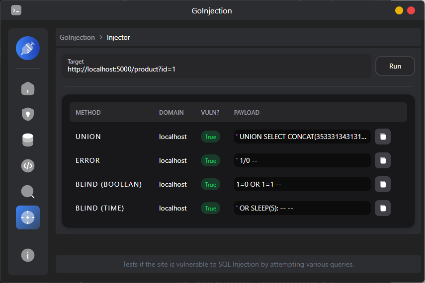

# GoInjection


## Overview
This project is designed to perform SQL injection testing on various database systems. It includes functions to determine the number of columns in a database table and to identify the database type based on the response to SQL injection queries.

## Features
- SQL Injection Testing: Perform SQL injection testing on various database systems.
- Column Count Detection: Determine the number of columns in a database table using SQL injection.
- Database Type Identification: Identify the database type (MySQL, PostgreSQL, MsSQL, SQLite) based on SQL injection responses.
- Word Count Analysis: Count the occurrences of words in the response to help identify the database.
- WAF Detection: Detect the presence of Web Application Firewalls (WAF) by analyzing HTTP responses and status codes.
- WAF Identification: Identify specific WAFs (e.g., Cloudflare, Cloudfront, Akamai, Sucuri) based on HTTP headers and response content.
- Multi-DBMS Support: Support for multiple database management systems (DBMS) including MySQL, PostgreSQL, MsSQL, and SQLite.

## Testing
```sql
USE sql_injection_lab;

CREATE TABLE IF NOT EXISTS products (
    id INT AUTO_INCREMENT PRIMARY KEY,
    name VARCHAR(100) NOT NULL,
    price DECIMAL(10, 2) NOT NULL
);

INSERT INTO products (name, price) VALUES
('Laptop', 799.99),
('Smartphone', 599.99),
('Tablet', 399.99),
('Headphones', 49.99),
('Smartwatch', 199.99);
```
The project includes a test site that is located in `SQL_Injection_Lab.py` file.

## ToDo
- Add more methods for Getting Database and Columns.
- Add Table dumping.
- Make a GUI for the project.

## License
This project is licensed under the MIT License. See the `LICENSE` file for more details.
